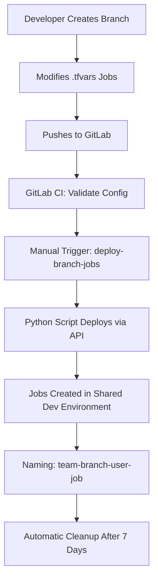
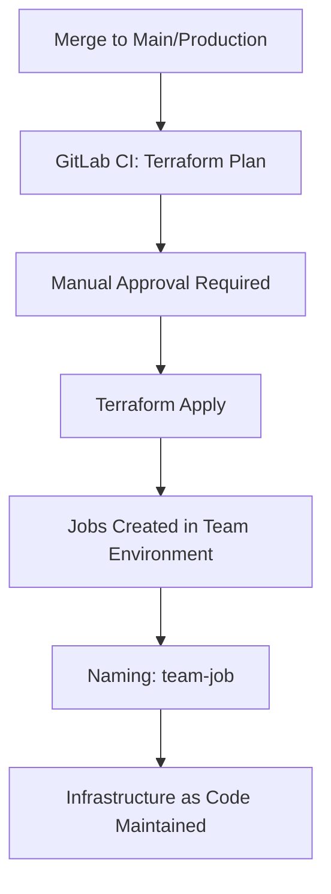

# Multi-Team dbt Cloud Architecture

This document explains the comprehensive multi-team dbt Cloud setup with user management, multiple projects, and the hybrid API/Terraform deployment approach.

## 🏗️ Overall Architecture

```
┌─────────────────────────────────────────────────────────────────────────────────┐
│                              dbt Cloud Account                                  │
│                                                                                 │
│  ┌─────────────────┐  ┌─────────────────┐  ┌─────────────────┐  ┌──────────────┐│
│  │  Analytics      │  │   Marketing     │  │    Finance      │  │  Platform    ││
│  │   Project       │  │   Analytics     │  │   Reporting     │  │    Core      ││
│  │                 │  │   Project       │  │   Project       │  │   Project    ││
│  └─────────────────┘  └─────────────────┘  └─────────────────┘  └──────────────┘│
│                                                                                 │
│  ┌─────────────────────────────────────────────────────────────────────────────┐│
│  │                        Shared terraform-dev Environment                     ││
│  │                      (for all teams' branch deployments)                   ││
│  └─────────────────────────────────────────────────────────────────────────────┘│
│                                                                                 │
│  ┌─────────────────────────────────────────────────────────────────────────────┐│
│  │                            User Groups & Permissions                        ││
│  │  • Analytics Team    • Marketing Team    • Finance Team    • Platform Team ││
│  │  • Data Analysts (cross-project read access)                               ││
│  └─────────────────────────────────────────────────────────────────────────────┘│
└─────────────────────────────────────────────────────────────────────────────────┘
```

## 📊 Project Structure

### **1. Platform Team Infrastructure** (`dbt-cloud-admin`)
**Repository**: `gitlab.company.com/platform/dbt-cloud-admin`  
**Responsibility**: Central infrastructure management

#### **What It Creates:**
- 📁 **4 dbt Cloud Projects**: Analytics, Marketing, Finance, Platform
- 🏢 **12 Environments**: 3 environments × 4 teams (dev, staging, prod)
- 🔗 **12 Snowflake Connections**: Team-specific databases and roles
- 👥 **User Management**: 15+ users across teams with proper permissions
- 🛡️ **Security Groups**: Team-based access control with SSO mapping
- 🌐 **Shared Environment**: `terraform-dev-shared` for branch deployments

#### **Key Features:**
```hcl
# Multiple Projects
resource "dbtcloud_project" "analytics" { name = "Analytics Team" }
resource "dbtcloud_project" "marketing" { name = "Marketing Analytics" }
resource "dbtcloud_project" "finance" { name = "Finance Reporting" }
resource "dbtcloud_project" "platform" { name = "Data Platform Core" }

# Team-Specific Environments
resource "dbtcloud_environment" "analytics_environments" {
  # Creates: analytics-dev, analytics-staging, analytics-prod
}

# User Groups with Permissions
resource "dbtcloud_group" "analytics_team" {
  name = "Analytics Team"
  group_permissions = [{
    permission_set = "developer"
    project_id     = dbtcloud_project.analytics.id
  }]
}
```

### **2. Analytics Team** (`dbt-analytics-team`)
**Repository**: `gitlab.company.com/analytics/dbt-analytics-team`  
**Responsibility**: Analytics job management

#### **Job Focus Areas:**
- 📈 **Core Data Models**: Foundation data transformation
- 📊 **Customer Analytics**: Behavior and segmentation analysis  
- ✅ **Data Quality**: Critical validation and monitoring
- 🔄 **Operational**: Snapshots and compliance validation

#### **Environment Configuration:**
- **Dev**: 9 jobs (shared environment for branches)
- **Test**: 8 jobs (analytics staging environment)
- **Prod**: 7 jobs (analytics production environment)

### **3. Marketing Analytics Team** (`dbt-marketing-analytics-team`)
**Repository**: `gitlab.company.com/marketing/dbt-marketing-analytics-team`  
**Responsibility**: Marketing-focused analytics

#### **Job Focus Areas:**
- 🎯 **Attribution Models**: Multi-touch attribution analysis
- 📊 **Campaign Performance**: Cross-platform campaign tracking
- 👥 **Customer LTV**: Lifetime value modeling and segmentation
- 📱 **Platform Integration**: Facebook, Google, LinkedIn ad sync
- 📈 **Executive Reporting**: C-level marketing dashboards

#### **Environment Configuration:**
- **Dev**: 9 jobs (shared environment for branches)
- **Test**: 6 jobs (marketing staging environment)  
- **Prod**: 5 jobs (marketing production environment)

## 👥 User Management & Permissions

### **Team Structure**

#### **Analytics Team** (4 users)
```hcl
analytics_users = {
  sarah_chen = {
    email = "sarah.chen@company.com"
    first_name = "Sarah"
    last_name = "Chen"
  }
  mike_rodriguez = {
    email = "mike.rodriguez@company.com"
    first_name = "Mike"  
    last_name = "Rodriguez"
  }
  # ... additional users
}
```
**Permissions**: Developer access to Analytics project only

#### **Marketing Team** (3 users)
```hcl
marketing_users = {
  jennifer_lopez = {
    email = "jennifer.lopez@company.com"
    first_name = "Jennifer"
    last_name = "Lopez"
  }
  # ... additional users
}
```
**Permissions**: Developer access to Marketing project only

#### **Finance Team** (3 users)
**Permissions**: Developer access to Finance project only

#### **Platform Team** (3 users)
**Permissions**: Admin access to ALL projects

#### **Data Analysts Group** (cross-functional)
**Permissions**: Read-only (analyst) access to Analytics and Marketing projects

### **Permission Matrix**

| Group | Analytics Project | Marketing Project | Finance Project | Platform Project |
|-------|------------------|-------------------|-----------------|------------------|
| Analytics Team | 🔧 Developer | ❌ No Access | ❌ No Access | ❌ No Access |
| Marketing Team | ❌ No Access | 🔧 Developer | ❌ No Access | ❌ No Access |
| Finance Team | ❌ No Access | ❌ No Access | 🔧 Developer | ❌ No Access |
| Platform Team | 👑 Admin | 👑 Admin | 👑 Admin | 👑 Admin |
| Data Analysts | 👁️ Analyst | 👁️ Analyst | ❌ No Access | ❌ No Access |

## 🌍 Environment Strategy

### **Shared Development Environment**
```
terraform-dev-shared (Environment ID: 999)
├── 🏢 Owned by: Platform Team
├── 🎯 Used by: ALL teams for branch deployments
├── 🔗 Connection: Platform Snowflake connection
└── 📝 Purpose: Conflict-free branch job testing
```

**Branch Job Naming**: `{team}-{branch}-{user}-{job}`
- Example: `marketing-team-feature-attribution-v2-jennifer-lopez-campaign-performance`

### **Team-Specific Environments**

#### **Analytics Team Environments**
- `analytics-dev` (ID: 201) - Analytics development
- `analytics-staging` (ID: 202) - Analytics testing  
- `analytics-prod` (ID: 301) - Analytics production

#### **Marketing Team Environments**
- `marketing-dev` (ID: 211) - Marketing development
- `marketing-staging` (ID: 212) - Marketing testing
- `marketing-prod` (ID: 311) - Marketing production

#### **Finance Team Environments**
- `finance-dev` (ID: 221) - Finance development
- `finance-staging` (ID: 222) - Finance testing
- `finance-prod` (ID: 321) - Finance production

#### **Platform Team Environments**
- `platform-dev` (ID: 231) - Platform development
- `platform-staging` (ID: 232) - Platform testing
- `platform-prod` (ID: 331) - Platform production

## 🏢 Snowflake Integration

### **Database Strategy**
Each team gets dedicated Snowflake databases per environment:

#### **Development Databases**
- `ANALYTICS_DEV` - Analytics team development
- `MARKETING_DEV` - Marketing team development  
- `FINANCE_DEV` - Finance team development
- `PLATFORM_DEV` - Platform team development

#### **Production Databases**
- `ANALYTICS_PROD` - Analytics production data
- `MARKETING_PROD` - Marketing production data
- `FINANCE_PROD` - Finance production data
- `PLATFORM_PROD` - Platform core production data

### **Role-Based Access**
```sql
-- Analytics team roles
ANALYTICS_DEV_ROLE     -- Development access
ANALYTICS_STAGING_ROLE -- Staging access  
ANALYTICS_PROD_ROLE    -- Production access

-- Marketing team roles
MARKETING_DEV_ROLE     -- Development access
MARKETING_STAGING_ROLE -- Staging access
MARKETING_PROD_ROLE    -- Production access

-- And so on for Finance and Platform teams...
```

## 🔄 Deployment Workflows

### **Branch Deployment (API-based)**


### **Production Deployment (Terraform)**


## 📋 Information Sharing Between Teams

### **Platform Team Outputs**
The platform team provides these outputs for teams to reference:

```hcl
output "team_reference_guide" {
  value = {
    analytics_team = {
      project_id = 101
      environments = {
        dev = 201
        staging = 202  
        prod = 301
      }
      shared_dev_environment_id = 999
    }
    
    marketing_team = {
      project_id = 102
      environments = {
        dev = 211
        staging = 212
        prod = 311  
      }
      shared_dev_environment_id = 999
    }
    # ... other teams
  }
}
```

### **Team Configuration Files**
Teams reference these IDs in their `.tfvars` files:

```hcl
# Marketing team's dev_env.tfvars
project_id = "102"     # From platform team output
environment_id = "999" # Shared dev environment
```

## 🚀 Scaling Benefits

### **Organizational Benefits**
- ✅ **Team Autonomy**: Each team manages their own jobs independently
- ✅ **Clear Ownership**: Defined boundaries between infrastructure and jobs
- ✅ **Scalable**: Supports 3000+ developers across multiple teams
- ✅ **Secure**: Team-based access control with proper permissions

### **Technical Benefits**
- ✅ **No State Conflicts**: API deployment prevents Terraform collisions
- ✅ **Automatic Cleanup**: Old branch jobs removed automatically
- ✅ **Environment Isolation**: Team data is properly separated
- ✅ **Audit Trail**: All changes tracked through Git and Terraform

### **Operational Benefits**
- ✅ **Rapid Development**: Branch jobs deploy in minutes
- ✅ **Safe Production**: Terraform provides infrastructure-as-code for prod
- ✅ **Easy Monitoring**: Team-specific dashboards and alerting
- ✅ **Cost Control**: Shared dev environment reduces infrastructure costs

## 🔧 Getting Started

### **For Platform Teams**
1. Deploy `dbt-cloud-admin` infrastructure
2. Configure users and groups
3. Share environment IDs with teams
4. Monitor overall system health

### **For Analytics/Marketing/Finance Teams**
1. Clone your team's repository
2. Configure environment variables with platform team's outputs
3. Customize job configurations in `.tfvars` files
4. Deploy branches for development, production for releases

## 📚 Additional Resources

- [Platform Team Setup Guide](dbt-cloud-admin/README.md)
- [Analytics Team Guide](dbt-analytics-team/README.md)  
- [Marketing Team Guide](dbt-marketing-analytics-team/README.md)
- [API Job Management Documentation](dbt-analytics-team/scripts/README.md)

---

This architecture supports enterprise-scale dbt Cloud deployments with proper team isolation, user management, and hybrid deployment strategies for maximum efficiency and safety.