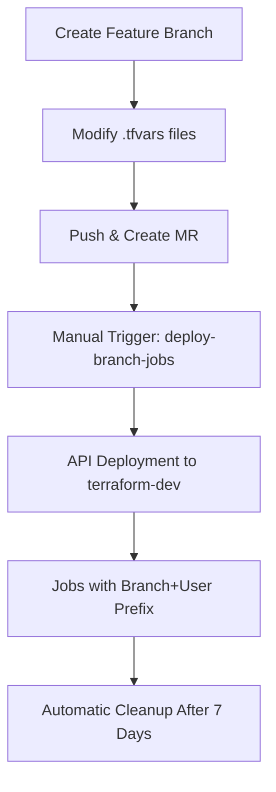
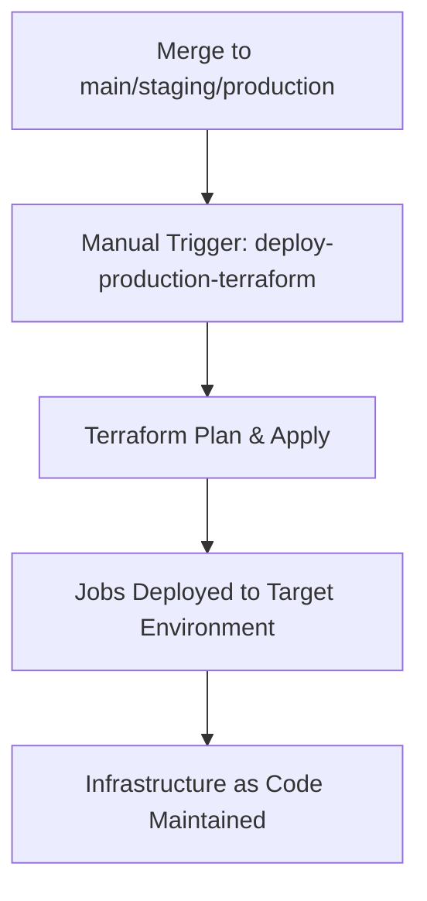

# dbt Analytics Team - Job Management

This repository manages dbt Cloud jobs for the Analytics Team using a **hybrid deployment approach**:

- 🌿 **Branch Jobs**: API-based deployment to shared `terraform-dev` environment
- 🏭 **Production Jobs**: Terraform-based deployment to dedicated environments

## 🏗️ Architecture Overview

```
┌─────────────────┐    ┌──────────────────┐    ┌─────────────────┐
│   Feature       │    │   dbt Cloud      │    │  Environments   │
│   Branches      │───▶│   REST API       │───▶│  terraform-dev  │
│                 │    │                  │    │                 │
└─────────────────┘    └──────────────────┘    └─────────────────┘

┌─────────────────┐    ┌──────────────────┐    ┌─────────────────┐
│ Main/Staging/   │    │   Terraform      │    │ dev/test/prod   │
│ Production      │───▶│   Provider       │───▶│ environments    │
│                 │    │                  │    │                 │
└─────────────────┘    └──────────────────┘    └─────────────────┘
```

## 🎯 Why This Approach?

### The Problem
With 3000+ developers, traditional Terraform state management creates conflicts when multiple developers deploy jobs simultaneously.

### The Solution
- **Branch jobs** use API calls (stateless) for conflict-free deployment
- **Production jobs** use Terraform for proper infrastructure-as-code practices
- **Automatic cleanup** removes old branch jobs to prevent environment bloat

## 📁 Repository Structure

```
dbt-analytics-team/
├── scripts/
│   └── dbt_job_manager.py          # Python API client for job management
├── env_file/
│   ├── dev_env.tfvars              # Development environment config & jobs
│   ├── test_env.tfvars             # Test environment config & jobs
│   └── prod_env.tfvars             # Production environment config & jobs
├── requirements.txt                # Python dependencies
├── .gitlab-ci.yml                 # CI/CD pipeline
├── main.tf                        # Terraform configuration (production)
├── variables.tf                   # Terraform variables
└── README.md                      # This file
```

## 🚀 Quick Start

### 1. Configure Environment Variables

Set these in your GitLab CI/CD settings:

```bash
# Required for all deployments
DBTCLOUD_ACCOUNT_ID=123456
DBTCLOUD_TOKEN=your-api-token-here
PROJECT_ID=789012
ENVIRONMENT_ID=345678  # terraform-dev environment ID

# Optional
DBTCLOUD_HOST_URL=https://cloud.getdbt.com  # Default
TEAM_NAME=analytics-team                    # Default
```

### 2. Deploy Branch Jobs (Development)

1. Create a feature branch: `git checkout -b feature/new-analysis`
2. Modify job configurations in `env_file/dev_env.tfvars`
3. Push changes and create merge request
4. Manually trigger `deploy-branch-jobs` in GitLab CI

**Result**: Jobs deployed to `terraform-dev` environment with naming pattern:
```
analytics-team-feature-new-analysis-john-doe-core-daily-refresh
analytics-team-feature-new-analysis-john-doe-customer-analytics
```

### 3. Deploy Production Jobs

1. Merge to `main` branch (deploys to dev environment)
2. Merge to `staging` branch (deploys to test environment)  
3. Merge to `production` branch (deploys to prod environment)
4. Manually trigger `deploy-production-terraform` in GitLab CI

**Result**: Jobs deployed via Terraform with naming pattern:
```
analytics-team-core-daily-refresh
analytics-team-customer-analytics
```

## 📋 Job Configuration

Jobs are defined in `.tfvars` files (single source of truth for both API and Terraform):

```hcl
jobs = [
  {
    name          = "core-daily-refresh"
    description   = "Daily refresh of core foundational models"
    execute_steps = [
      "dbt deps",
      "dbt run --select tag:core",
      "dbt test --select tag:core"
    ]
    schedule_type  = "every_day"
    schedule_hours = [6]  # 6 AM
    job_type       = "daily"
  }
]
```

### Supported Configuration Options

| Field | Type | Description | Example |
|-------|------|-------------|---------|
| `name` | string | Base job name (will be prefixed) | `"core-daily-refresh"` |
| `description` | string | Job description | `"Daily refresh of core models"` |
| `execute_steps` | array | dbt commands to run | `["dbt run", "dbt test"]` |
| `schedule_type` | string | Schedule pattern | `"every_day"`, `"weekly"`, `"custom"`, `"manual"` |
| `schedule_hours` | array | Hours to run (0-23) | `[6, 18]` |
| `schedule_days` | array | Days to run (1-7, Mon-Sun) | `[1, 2, 3, 4, 5]` |
| `threads` | integer | dbt thread count | `4` |
| `generate_docs` | boolean | Generate documentation | `true` |

## 🧹 Cleanup Process

### Automatic Cleanup
- Runs on `main` branch deployments
- Removes branch jobs older than 7 days
- Only affects jobs matching branch naming pattern

### Manual Cleanup
```bash
# Dry run to see what would be deleted
python scripts/dbt_job_manager.py cleanup --older-than 7 --dry-run

# Actually delete old jobs
python scripts/dbt_job_manager.py cleanup --older-than 7
```

### Emergency Cleanup
Set GitLab CI variable `EMERGENCY_CLEANUP=true` to remove all branch jobs older than 1 day.

## 🛠️ Local Development

### Prerequisites
- Python 3.9+
- dbt Cloud API access

### Setup
```bash
# Install dependencies
pip install -r requirements.txt

# Set environment variables
export DBTCLOUD_ACCOUNT_ID=123456
export DBTCLOUD_TOKEN=your-token
export PROJECT_ID=789012
export ENVIRONMENT_ID=345678
export TEAM_NAME=analytics-team
export CI_COMMIT_REF_SLUG=local-dev
export GITLAB_USER_LOGIN=your-username
```

### Commands
```bash
# Deploy jobs locally
python scripts/dbt_job_manager.py deploy --config env_file/dev_env.tfvars

# Validate configuration without deploying
python scripts/dbt_job_manager.py deploy --config env_file/dev_env.tfvars --dry-run

# List team jobs
python scripts/dbt_job_manager.py list --details

# Clean up old jobs
python scripts/dbt_job_manager.py cleanup --older-than 7 --dry-run
```

## 🔧 CI/CD Pipeline Details

### Pipeline Stages

1. **validate**: Validates YAML syntax and configuration
2. **deploy-branch**: API-based deployment for feature branches
3. **deploy-production**: Terraform deployment for main/staging/production
4. **cleanup**: Removes old branch jobs

### Manual Triggers

| Job | Trigger | Purpose |
|-----|---------|---------|
| `deploy-branch-jobs` | Manual | Deploy feature branch jobs |
| `deploy-production-terraform` | Manual | Deploy production jobs |
| `cleanup-old-branch-jobs` | Manual | Clean up old branch jobs |
| `emergency-cleanup` | Variable: `EMERGENCY_CLEANUP=true` | Aggressive cleanup |
| `list-team-jobs` | Variable: `LIST_JOBS=true` | List all team jobs |
| `show-help` | Variable: `SHOW_HELP=true` | Display help information |

### Branch Deployment Workflow



### Production Deployment Workflow



## 🏷️ Job Naming Conventions

### Branch Jobs (API Deployment)
```
{team_name}-{branch_name}-{gitlab_user}-{job_name}
```
Examples:
- `analytics-team-feature-abc-john-doe-core-daily-refresh`
- `analytics-team-bugfix-xyz-jane-smith-customer-analytics`

### Production Jobs (Terraform Deployment)
```
{team_name}-{job_name}
```
Examples:
- `analytics-team-core-daily-refresh`
- `analytics-team-customer-analytics`

## 🔍 Monitoring & Debugging

### List All Team Jobs
```bash
python scripts/dbt_job_manager.py list --details
```

### Check Job Status in dbt Cloud
1. Go to dbt Cloud console
2. Navigate to Jobs section
3. Filter by team prefix: `analytics-team-`

### Common Issues

#### Issue: Job Already Exists Error
**Solution**: The script automatically handles updates. If you see this error, check that job names are unique.

#### Issue: Environment Not Found
**Solution**: Verify `ENVIRONMENT_ID` matches your target environment in dbt Cloud.

#### Issue: API Permission Denied
**Solution**: Ensure your `DBTCLOUD_TOKEN` has the following permissions:
- Read and write access to jobs
- Read access to projects and environments

## 🔐 Security Considerations

### API Token Management
- Store tokens in GitLab CI/CD variables (masked)
- Use separate tokens for different environments
- Rotate tokens regularly
- Limit token permissions to minimum required

### Environment Isolation
- Branch jobs deploy to shared `terraform-dev` environment
- Production jobs deploy to dedicated environments
- No cross-environment access

## 📚 Additional Resources

### dbt Cloud API Documentation
- [Jobs API](https://docs.getdbt.com/dbt-cloud/api-v2#/operations/Create%20Job)
- [Authentication](https://docs.getdbt.com/dbt-cloud/api-v2#section/Authentication)

### Related Repositories
- `dbt-cloud-admin`: Infrastructure and environment management
- Main dbt project repository with models and tests

### Support
For questions or issues:
1. Check this README
2. Review GitLab CI logs
3. Contact the Analytics Platform team
4. Create an issue in this repository

## 🔄 Migration Guide

### From Previous Setup
If migrating from a different job management approach:

1. **Backup existing jobs**: Export current job configurations
2. **Update job names**: Follow new naming conventions
3. **Configure environments**: Set up terraform-dev environment
4. **Test with branches**: Deploy a test branch first
5. **Migrate production**: Update production jobs using Terraform

### Version History
- **v1.0**: Initial API-based deployment approach
- **v1.1**: Added Terraform support for production
- **v1.2**: Added automatic cleanup functionality
- **v1.3**: Enhanced documentation and monitoring